name: inverse
layout: true
class: center, middle, inverse
---
# <span style="font-size: 30%">【Swift編】</span><br>__クーポン配信アプリ<br>を作ろう！__</span>

@富士通クラウドテクノロジーズ

.footnote[
20190115 前野 粒子
]
---
layout: false
## サービス登録
まず最初に、ニフクラ mobile backendの登録を行います。<br>
[ホームページ](https://mbaas.nifcloud.com/about.htm)右上にある「無料登録」ボタンをクリックして、<br>
アカウント登録を実施してください

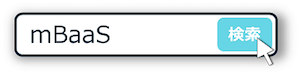


---
## サービス登録
「会員登録（無料）」のボタンをクリックしてください。

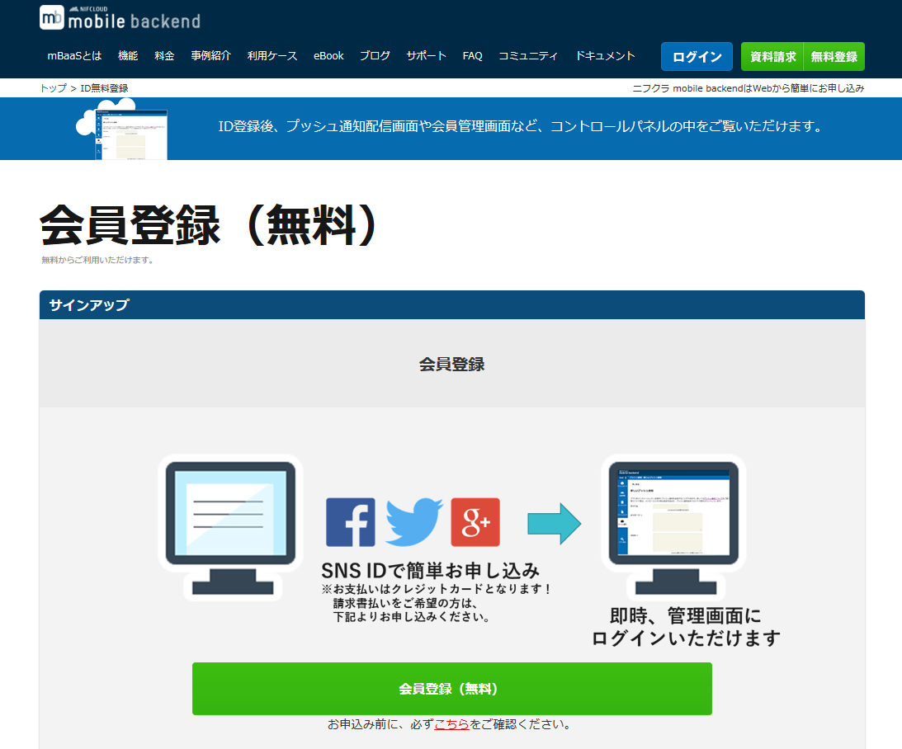

---
## サービス登録
持っているSNSアカウントでログインしてください。ログイン後、利用規約の同意およびメールアドレスの登録をおこなってください。<br>
メールアドレスあてにメールが届きますので、メール内のURLをクリックしてください。

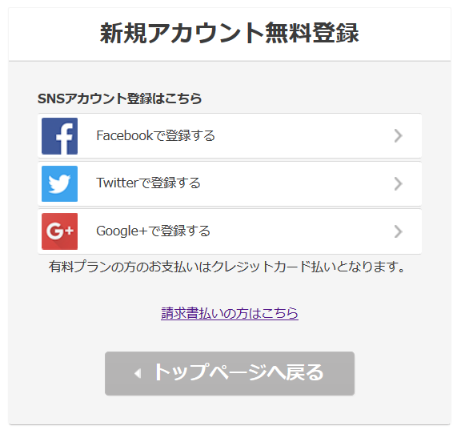

---
## 今回のハンズオンセミナーについて
### セミナーの形式

お疲れ様でした！では、アプリ開発を始めます。

.left-column[
  .center[
  ５0分でアプリ完成させます<br><br>
  
  ]
]
.right-column[
  .center[
  講義形式で説明と演習を繰り返して<br>アプリを作成します<br><br>
  
  ]
]

---
## ニフクラ mobile backendとは
### サービス紹介

* さきほどから何度もご紹介しておりますが、ねんのため復習です！
* スマホアプリで汎用的に実装される機能を、クラウドサービスとして提供しているサービスです
 * 通称「mBaaS（＝mobile Backend as a Service)」と呼びます

.center[
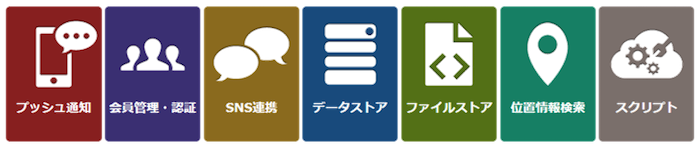
]

---
## ニフクラ mobile backendとは
### iOS SDKの特徴

* SDKはObjective-Cを提供しています。Swiftはブリッジして使う必要があります。
* 通常、SDKのインストールが必要です
 * 今回は実装済み
 * 参考：[クイックスタート](https://mbaas.nifcloud.com/doc/current/introduction/quickstart_ios.html)
* SDKの初期化処理が必要です
 * 後で処理を実装します

```swift
NCMB.setApplicationKey("YOUR_NCMB_APPLICATIONKEY", clientKey: "YOUR_NCMB_CLIENTKEY")
```

---
## ハンズオンの概要
### 作成するアプリについて

* ショップアプリを想定しています。
* メールアドレスを用いた会員登録、ログイン、クラウドと連携したショップ情報の表示を行います。（てんこもりです…！）

.center[

]

---
## 今回のハンズオンセミナーについて
### 学ぶ内容

「mBaaS Shop List」アプリの作成を通して、ネットワークとデータベースを用いたアプリ開発について学びます。

* mBaaSの連携部分をコーディングし、アプリを完成させ、次の内容を実現していきます
 * メールアドレスを入力させて、該当メールアドレスが利用できるかどうかの確認（Confirm）を行えます
 * メールアドレスとパスワードで会員登録が行えます
 * 会員登録をすると、クラウド上のお店情報を見ることができます
 * クラウド上のデータを更新することで、アプリへ配信される情報も変化します

---
## 今回のハンズオンセミナーについて
### 学ぶ内容

「mBaaS Shop List」アプリの作成を通して、ネットワークとデータベースを用いたアプリ開発について学びます。

* mBaaSの連携部分をコーディングし、アプリを完成させ、次の内容を実現していきます
 * メールアドレスを入力させて、該当メールアドレスが利用できるかどうかの確認（Confirm）を行えます
 * メールアドレスとパスワードで会員登録が行えます
 * 会員登録をすると、クラウド上のお店情報を見ることができます
 * クラウド上のデータを更新することで、アプリへ配信される情報も変化します

---
## ハンズオンの流れ

__<font size="6">「mBaaS Shop List」アプリを作ろう！</font>__

.size_large[
1. ハンズオンの準備
1. 会員管理機能の作成
1. Shop情報の設定
]

---
layout: true
class: center, middle, inverse_sub
---
#「mBaaS Shop List」<br>アプリを作ろう！

---
layout: true
class: center, middle, inverse
---
# 1.ハンズオンの準備

---
layout: false
## ハンズオンの準備
### Xcodeプロジェクトをダウンロード

下記リンクをクリックして、ZIPファイルでダウンロードしてください▼<br>
.size_large[
　　　 __[SwiftAdvancePushApp](https://mbaas.api.nifcloud.com/2013-09-01/applications/mo6Dk88jwqcUspJo/publicFiles/SwiftAdvancePushApp-master.zip)__
]

* ディレクトリにある「__SwiftAdvancePushApp.xcworkspace__」をダブルクリックして、Xcodeを開いてください

---
## ハンズオンの準備
### プロジェクトにあらかじめ実施していること

* mBaaS iOS SDKのインストール
* mBaaSとの連携以外の処理のコーディング
 * アプリのデザインを`Main.storyboard`で作成し、処理は画面ごと`ViewController`にコーディングしています

---
## ハンズオンの準備
### mBaaSの準備

* [mBaaS](https://mbaas.nifcloud.com/)にログインしてアプリを作成します

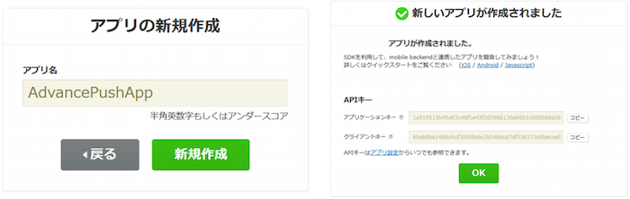

---
## ハンズオンの準備
### APIキーの設定とSDKの初期化

* `LoginViewController.swift`を開きます
* ３３行目、`viewDidLoad()`メソッド内に処理を実装します[一部実装済み]

```swift
// 【APIキーの設定】
NCMB.setApplicationKey("YOUR_NCMB_APPLICATIONKEY", clientKey: "YOUR_NCMB_CLIENTKEY")
```

* 初期化処理の「`YOUR_NCMB_APPLICATIONKEY`」，「`YOUR_NCMB_CLIENTKEY`」の部分をアプリ作成時に発行されたAPIキーに書き換えてください
 * APIキーは、mBaaSのダッシュボードから「アプリ設定」→「基本」にあります

---
layout: true
class: center, middle, inverse
---
# 2.会員管理機能の作成

---
layout: false
## 会員管理機能の作成
### mBaaSの設定

* 会員管理設定の「メールアドレス/パスワード認証」を許可します

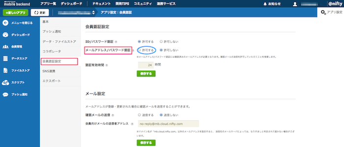

---
## 会員管理機能の作成

### 課題１：会員登録用メールを要求する

* 会員登録をする際に、メールアドレスを入力すると、メールアドレスあてに確認用URL付きのメールが送信されるようにしましょう！

.center[
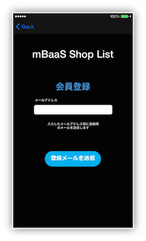
]

---
## 会員管理機能の作成
### 課題１：会員登録用メールを要求する

* `SignUpViewController.swift`を開きます
* 会員登録処理は以下のように実装されます。入力してみてください！

```swift
// 【課題１】会員登録用メールを要求する
        var error : NSError? = nil
        NCMBUser.requestAuthenticationMail(address.text, error: &error)
        if error != nil {
            // 会員登録用メールの要求失敗時の処理
        } else {
            // 会員登録用メールの要求失敗時の処理
        }
```

.footnote[
[会員登録メール要求APIのリファレンス](https://mbaas.nifcloud.com/doc/current/rest/user/requestMailForUserAuthenticaiton.html)
]

---
## 会員管理機能の作成
### 課題１：会員登録用メールを要求する

* それぞれ処理を追記してみてください！

```swift
// 会員登録用メールの要求失敗時の処理
print("エラーが発生しました：\(error!.code)")
self.statusLabel.text = "エラーが発生しました：\(error!.code)"
```

```swift
// 会員登録用メールの要求失敗時の処理
print("登録用メールを送信しました")
self.statusLabel.text = "登録用メールを送信しました"
// TextFieldを空にする
self.address.text = ""
```

---
## 会員管理機能の作成
### 課題１：動作確認　会員登録をしてみましょう

* ここではシミュレーターでビルドし、動作確認を行います
* 起動後、「会員登録」をタップします
* 会員登録画面でメールアドレスを入力し「登録メールを送信」をタップします
 * ログを確認してください

.center[
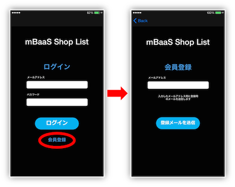
]
.footnote[
[エラーコード一覧](https://mbaas.nifcloud.com/doc/current/rest/common/error.html#REST%20API%E3%81%AE%E3%82%A8%E3%83%A9%E3%83%BC%E3%82%B3%E3%83%BC%E3%83%89%E3%81%AB%E3%81%A4%E3%81%84%E3%81%A6)
]

---
## 会員管理機能の作成
### 課題１：動作確認　会員登録をしてみましょう

* 会員登録メールが届くので、パスワードを設定します

.center[

]

---
## 会員管理機能の作成
### 課題１：動作確認　会員登録をしてみましょう

* mBaaSの管理画面の「会員管理」を確認してください
 * 会員管理にユーザーが登録されました！

.center[
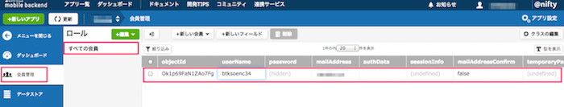
]
.footnote[
[エラーコード一覧](https://mbaas.nifcloud.com/doc/current/rest/common/error.html#REST%20API%E3%81%AE%E3%82%A8%E3%83%A9%E3%83%BC%E3%82%B3%E3%83%BC%E3%83%89%E3%81%AB%E3%81%A4%E3%81%84%E3%81%A6)
]

---
## 会員管理機能の作成
### 課題２：メールアドレスとパスワードでログイン<br>

.center[
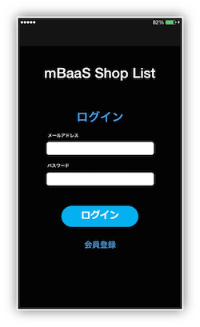
]

---
## 会員管理機能の作成
### 課題２：メールアドレスとパスワードでログイン

* `LoginViewController.swift`を開きます
* ログイン処理は以下のように実装されます

```swift
// 【課題２】メールアドレスとパスワードでログイン
NCMBUser.logInWithMailAddress(inBackground: address.text, password: password.text) { (user: NCMBUser!, error) in
    if error != nil {
        // ログイン失敗時の処理
    } else {
        // ログイン成功時の処理
    }
 }
```

---
## 会員管理機能の作成
### 課題２：メールアドレスとパスワードでログイン

* それぞれ処理を追記しています

```swift
// ログイン失敗時の処理
print("ログインに失敗しました")
self.statusLabel.text = "ログインに失敗しました"
```

```swift
// ログイン成功時の処理
print("ログインに成功しました:\(user.objectId)")
// AppDelegateにユーザー情報を保持
self.appDelegate.current_user = user as NCMBUser
// TextFieldを空にする
self.cleanTextField()
// statusLabelを空にする
self.statusLabel.text = ""
// 画面遷移
self.performSegue(withIdentifier: "login", sender: self)
```

---
## 会員管理機能の作成
### 課題２：メールアドレスとパスワードでログイン<br>

無事ログインできることを確認してください！

.center[

]

---
## 会員管理機能の作成
### ここまででできたこと

* わずか数行で、「確認用トークンを付与したURL付きのメールを送信」し、「会員登録」する機能が作れた
* わずか数行で、「メールアドレスと

---
## 会員管理機能の作成
### 会員管理③：ユーザー情報更新

.center[
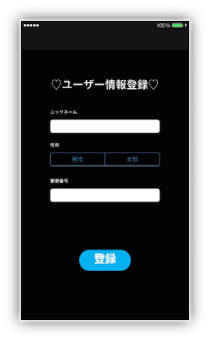
]

---
## 会員管理機能の作成
### 会員管理③：ユーザー情報更新


* `TopViewController.swift`を開きます
* 初回のみ表示されるユーザー情報登録画面に入力した情報をmBaaSのユーザー情報に追加する処理を実装します
* コメントの下にコードを追記していきます

```swift
// 【mBaaS：会員管理③】ユーザー情報更新

```

* かなり下の方にあります

---
## 会員管理機能の作成
### 会員管理③：ユーザー情報更新

```swift
// 【mBaaS：会員管理③】ユーザー情報更新
// ログイン中のユーザーを取得
let user = NCMBUser.currentUser()
// ユーザー情報を設定
user.setObject(self.nickname.text, forKey: "nickname")
user.setObject(self.GENDER_CONFIG[self.genderSegCon.selectedSegmentIndex], forKey: "gender")
user.setObject(self.prefecture.text, forKey: "prefecture")
user.setObject([] as Array<String>, forKey: "favorite")
// user情報の更新
user.saveInBackgroundWithBlock({(error: NSError!) -> Void in
    if error != nil {
        // 更新失敗時の処理

    } else {
        // 更新成功時の処理

    }
})
```

---
## 会員管理機能の作成
### 会員管理③：ユーザー情報更新

* それぞれ処理を追記します

```swift
// 更新失敗時の処理
print("ユーザー情報更新に失敗しました:\(error.code)")
self.viewLabel.text = "登録に失敗しました（更新）:\(error.code)"
```

```swift
// 更新成功時の処理
print("ユーザー情報更新に成功しました")
// AppDelegateに保持していたユーザー情報の更新
self.appDelegate.current_user = user as NCMBUser
// 【mBaaS：プッシュ通知③】installationにユーザー情報を紐づける
  /*****後でここに処理を記述します*****/
// 画面を閉じる
self.registerView.hidden = true
// ニックネーム表示用ラベルの更新
self.nicknameLabel.text = "\(self.appDelegate.current_user.objectForKey("nickname"))さん、こんにちは！"
// 画面更新
self.checkShop()
```

---
layout: true
class: center, middle, inverse
---
# 3.Shop情報の設定

---
layout: false
## Shop情報の設定
### mBaaSにShop情報を用意する（データストア）

* ニフクラ mobile backendのダッシュボードから「データストア」を開き、「＋作成▼」ボタンをクリックし、「インポート」をクリックします
* クラス名に「__Shop__」と入力します
* ダウンロードしたサンプルプロジェクトにあるSettingフォルダ内の「__Shop.json__」を選択してアップロードします

.center[

]

---
## Shop情報の設定
### mBaaSにShop情報を用意する（データストア）

こんな感じでインポートされます

.center[
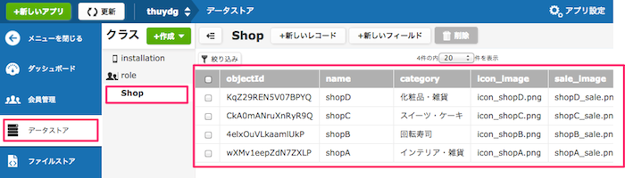
]

---
## Shop情報の設定
### mBaaSにShop情報を用意する（ファイルストア）

* ニフクラ mobile backendのダッシュボードから「ファイルストア」を開き、「↑アップロード」ボタンをクリックします
* ダウンロードしたサンプルプロジェクトにあるSettingフォルダ内の「icon」「Shop」「Sale」内にあるファイルをすべてをアップロードします

.center[
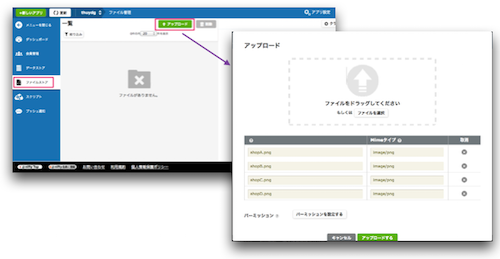
]

---
## Shop情報の設定
### mBaaSにShop情報を用意する（ファイルストア）

* こんな感じでアップロードされます

.center[
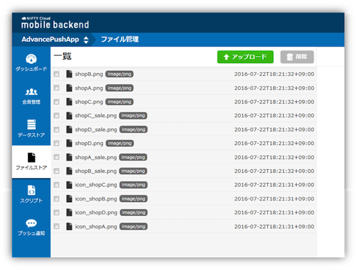
]

---
## Shop情報の設定
### データストア：「Shop」クラスのデータを取得

* `TopViewController.swift`を開きます
* インポートしたShopクラスのデータを取得する処理を実装します

```swift
// 【mBaaS：データストア】「Shop」クラスのデータを取得
// 「Shop」クラスのクエリを作成
let query = NCMBQuery(className: "Shop")
// データストアを検索
query.findObjectsInBackgroundWithBlock({ (objects: Array!, error: NSError!) -> Void in
    if error != nil {
        // 検索失敗時の処理

    } else {
        // 検索成功時の処理

    }
})
```

---
## Shop情報の設定
### データストア：「Shop」クラスのデータを取得

* それぞれ処理を追記します

```swift
// 検索失敗時の処理
print("検索に失敗しました:\(error.code)")
```

```swift
// 検索成功時の処理
print("検索に成功しました")
// AppDelegateに「Shop」クラスの情報を保持
self.appDelegate.shopList = objects as! Array
// テーブルの更新
self.shopTableView.reloadData()
```

---
## Shop情報の設定
### ファイルストア①：icon画像の取得

.center[
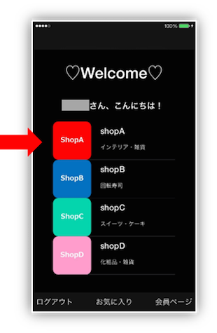
]

---
## Shop情報の設定
### ファイルストア①：icon画像の取得

* `CustomCell.swift`を開きます
 * `CustomCell.swift`はテーブルのセルを作成するファイルです
* トップ画面に各ショップのアイコンをmBaaSから取得して表示する処理を実装します

```swift
// 【mBaaS：ファイルストア①】icon画像の取得
// 取得した「Shop」クラスデータからicon名を取得
let imageName = object.objectForKey("icon_image") as! String
// ファイル名を設定
let imageFile = NCMBFile.fileWithName(imageName, data: nil)
// ファイルを検索
imageFile.getDataInBackgroundWithBlock { (data: NSData!, error: NSError!) -> Void in
    if error != nil {
        // ファイル取得失敗時の処理

    } else {
        // ファイル取得成功時の処理

    }
}
```

---
## Shop情報の設定
### ファイルストア①：icon画像の取得

* それぞれ処理を追記します

```swift
// ファイル取得失敗時の処理
print("icon画像の取得に失敗しました:\(error.code)")
```

```swift
// ファイル取得成功時の処理
print("icon画像の取得に成功しました")
// icon画像を設定
self.iconImageView_top.image = UIImage.init(data: data)
```
---
## Shop情報の設定
### ファイルストア②：Shop画像の取得

.center[
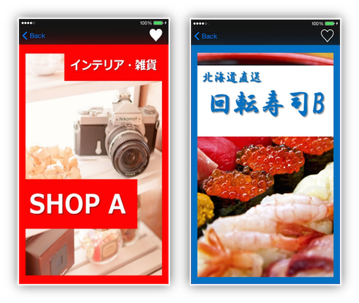
]

---
## Shop情報の設定
### ファイルストア②：Shop画像の取得[実装済み]

* `ShopViewController.swift`を開きます
* Shop画面に各ショップの画像をmBaaSから取得して表示する処理も同様に実装できます

```swift
// 【mBaaS：ファイルストア②】Shop画像の取得
// 取得した「Shop」クラスデータからshop画面用の画像名を取得
let imageName = appDelegate.shopList[shopIndex].objectForKey("shop_image") as! String
// ファイル名を設定
let imageFile = NCMBFile.fileWithName(imageName, data: nil)
// ファイルを検索
imageFile.getDataInBackgroundWithBlock { (data: NSData!, error: NSError!) -> Void in
    if error != nil {
        // ファイル取得失敗時の処理
        /* 省略 */
    } else {
        // ファイル取得成功時の処理
        /* 省略 */
    }
}
```

---
## Shop情報の設定
### 動作確認(2)会員情報登録とShop情報表示

* 再びシュミレーターでビルドし、動作確認を行います
* ログイン後初回のみ、ユーザー情報登録画面が表示されます
* 入力し「登録」をタップします
 * このとき、会員情報が更新されますので、mBaaSのダッシュボードを確認してみましょう
 * ログを確認してください

.center[
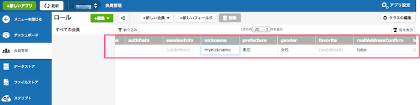
]
.footnote[
[エラーコード一覧](https://mbaas.nifcloud.com/doc/current/rest/common/error.html#REST%20API%E3%81%AE%E3%82%A8%E3%83%A9%E3%83%BC%E3%82%B3%E3%83%BC%E3%83%89%E3%81%AB%E3%81%A4%E3%81%84%E3%81%A6)
]

---
## Shop情報の設定
### 動作確認(2)会員情報登録とShop情報表示

* トップ画面に「icon画像」「Shop名」「カテゴリ」が表示されます
* Shopを１つ選んでタップします
 * mBaaSに登録されているimageにアクセスし、Shopページ（画像）が表示されます
* 会員ページをタップします
 * ユーザー情報が表示されます

.center[
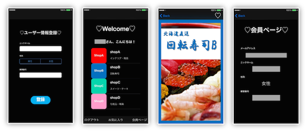
]
.footnote[
[エラーコード一覧](https://mbaas.nifcloud.com/doc/current/rest/common/error.html#REST%20API%E3%81%AE%E3%82%A8%E3%83%A9%E3%83%BC%E3%82%B3%E3%83%BC%E3%83%89%E3%81%AB%E3%81%A4%E3%81%84%E3%81%A6)
]

---
layout: true
class: center, middle, inverse
---
# 4.お気に入り機能の作成

---
layout: false
## お気に入り機能の作成
### お気に入り機能について

* お気に入り機能は好きなShopをお気に入りとして保存できる機能です
 * 「お気に入り」画面ではSwitchと「登録」ボタンで設定します
 * 「Shop」画面では右上のハートマークをタップすることでShop単位で設定できます(♥…ON,♡…OFF)

.center[
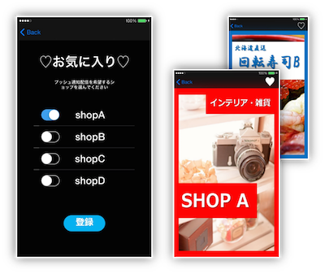
]

---
## お気に入り機能の作成
### 会員管理④：ユーザー情報の更新[実装済み]

* `FavoriteViewController.swift`を開きます
* お気に入り画面からfavoriteデータの更新処理はユーザー情報の登録と同様にして実装できます

```swift
// 【mBaaS：会員管理④】ユーザー情報の更新
// ログイン中のユーザーを取得
let user = NCMBUser.currentUser()
// favoriteに更新された値を設定
user.setObject(appDelegate.favoriteObjectIdTemporaryArray, forKey: "favorite")
// ユーザー情報を更新
user.saveInBackgroundWithBlock { (error: NSError!) -> Void in
    if error != nil {
        // 更新に失敗した場合の処理
        /* 省略 */
    } else {
        // 更新に成功した場合の処理
        /* 省略 */
    }
}
```

---
## お気に入り機能の作成

### 会員管理⑤：ユーザー情報の更新[実装済み]

* `ShopViewController.swift`を開きます
* Shop画面からもfavoriteデータの更新処理はユーザー情報の登録と同様にして実装できます

```swift
// 【mBaaS：会員管理⑤】ユーザー情報の更新
// ログイン中のユーザーを取得
let user = NCMBUser.currentUser()
// 更新された値を設定
user.setObject(favoriteObjectIdArray, forKey: "favorite")
// ユーザー情報を更新
user.saveInBackgroundWithBlock { (error: NSError!) -> Void in
    if error != nil {
        // 更新に失敗した場合の処理
        /* 省略 */
    } else {
        // 更新に成功した場合の処理
        /* 省略 */
    }
}
```

---
## お気に入り機能の作成
### 動作確認(3)お気に入り情報登録・更新

* 再びシュミレーターでビルドし、動作確認を行います
* ログイン後トップ画面下の「お気に入り」をタップします
* お気に入り画面からお気に入り登録をしてみましょう
* 各Shop画面からも同様に登録してみましょう
 * ログを確認してください

.center[
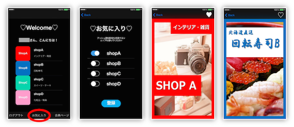
]

.footnote[
[エラーコード一覧](https://mbaas.nifcloud.com/doc/current/rest/common/error.html#REST%20API%E3%81%AE%E3%82%A8%E3%83%A9%E3%83%BC%E3%82%B3%E3%83%BC%E3%83%89%E3%81%AB%E3%81%A4%E3%81%84%E3%81%A6)
]

---
layout: true
class: center, middle, inverse_sub
---
# まとめ

---
layout: false
## まとめ
### 学んだこと

* mBaaSの各機能を使用してアプリ作成方法を学んだ！
 * 会員管理機能
 * データストア
 * ファイルストア

---
## 参考

* 開催中の[セミナー](https://mbaas.nifcloud.com/seminar.htm)のご案内
 * 随時新しいセミナーを実施していきますのでぜひチェックしてください！
* ハンズオン内容が実装された完全版プロジェクト
 * __[SwiftAdvancePushApp【完成版】](https://github.com/natsumo/SwiftAdvancePushApp/archive/master.zip)__
* コードは[GitHub](https://github.com/natsumo/SwiftAdvancePushApp)に公開しています
 * __master__：完成版
 * __seminar_version__：セミナー版
