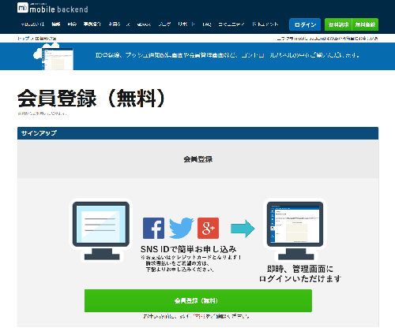
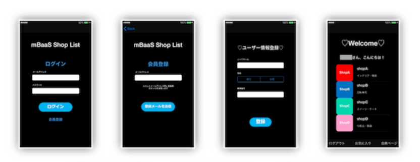

name: inverse
layout: true
class: center, middle, inverse
---
# <span style="font-size: 30%">【Swift編】</span><br>ショップアプリ<br>を作ろう！</span>

@富士通クラウドテクノロジーズ kousin

.footnote[
20190115 前野 粒子
]

---
## まずはじめに

本資料は、下記に配置してあります。
* https://maenoryuko.github.io/SwiftAdvancePushApp

---
layout: false
## サービス登録

ニフクラ mobile backendの登録を行います。<br>
[ホームページ](https://mbaas.nifcloud.com/about.htm)右上にある「無料登録」ボタンをクリックして、<br>
アカウント登録を実施してください


---
## サービス登録
「会員登録（無料）」のボタンをクリックしてください。



---
## サービス登録
持っているSNSアカウントでログインしてください。ログイン後、利用規約の同意およびメールアドレスの登録をおこなってください。<br>
メールアドレスあてにメールが届きますので、メール内のURLをクリックしてください。


---
## 今回のハンズオンセミナーについて
### セミナーの形式

お疲れ様でした！では、アプリ開発を始めます。

.left-column[
  .center[
  ５0分でアプリ完成させます<br><br>
  
  ]
]
.right-column[
  .center[
  講義形式で説明と演習を繰り返して<br>アプリを作成します<br><br>
  
  ]
]

---
## ニフクラ mobile backendとは
### サービス紹介

* さきほどから何度もご紹介しておりますが、ねんのため復習です！
* スマホアプリで汎用的に実装される機能を、クラウドサービスとして提供しているサービスです
 * 通称「mBaaS（＝mobile Backend as a Service)」と呼びます

.center[

]

---
## ニフクラ mobile backendとは
### iOS SDKの特徴

* SDKはObjective-Cを提供しています。Swiftはブリッジして使う必要があります。
* 通常、SDKのインストールが必要です
 * 今回は実装済み
 * 参考：[クイックスタート](https://mbaas.nifcloud.com/doc/current/introduction/quickstart_ios.html)
* SDKの初期化処理が必要です
 * 後で処理を実装します

```swift
NCMB.setApplicationKey("YOUR_NCMB_APPLICATIONKEY", clientKey: "YOUR_NCMB_CLIENTKEY")
```

---
## ハンズオンの概要
### 作成するアプリについて

* ショップアプリを想定しています。
* メールアドレスを用いた会員登録、ログイン、クラウドと連携したショップ情報の表示を行います。（てんこもりです…！）

.center[

]

---
## 今回のハンズオンセミナーについて
### 学ぶ内容

「mBaaS Shop List」アプリの作成を通して、ネットワークとデータベースを用いたアプリ開発について学びます。

* mBaaSの連携部分をコーディングし、アプリを完成させ、次の内容を実現していきます
 * メールアドレスを入力させて、該当メールアドレスが利用できるかどうかの確認（Confirm）を行えます
 * メールアドレスとパスワードで会員登録が行えます
 * 会員登録をすると、クラウド上のお店情報を見ることができます
 * クラウド上のデータを更新することで、アプリへ配信される情報も変化します

---
## 今回のハンズオンセミナーについて
### 学ぶ内容

「mBaaS Shop List」アプリの作成を通して、ネットワークとデータベースを用いたアプリ開発について学びます。

* mBaaSの連携部分をコーディングし、アプリを完成させ、次の内容を実現していきます
 * メールアドレスを入力させて、該当メールアドレスが利用できるかどうかの確認（Confirm）を行えます
 * メールアドレスとパスワードで会員登録が行えます
 * 会員登録をすると、クラウド上のお店情報を見ることができます
 * クラウド上のデータを更新することで、アプリへ配信される情報も変化します

---
## ハンズオンの流れ

__<font size="6">「mBaaS Shop List」アプリを作ろう！</font>__

.size_large[
1. ハンズオンの準備
1. 会員管理機能の作成
1. Shop情報の設定
]

---
layout: true
class: center, middle, inverse_sub
---
#「mBaaS Shop List」<br>アプリを作ろう！

---
layout: true
class: center, middle, inverse
---
# 1.ハンズオンの準備

---
layout: false
## ハンズオンの準備
### Xcodeプロジェクトをダウンロード

下記リンクをクリックして、ZIPファイルでダウンロードしてください▼<br>
.size_large[
　　　 __[SwiftAdvancePushApp](https://mbaas.api.nifcloud.com/2013-09-01/applications/mo6Dk88jwqcUspJo/publicFiles/SwiftAdvancePushApp-base.zip)__
]

* ディレクトリにある「__SwiftAdvancePushApp.xcworkspace__」をダブルクリックして、Xcodeを開いてください

---
## ハンズオンの準備
### プロジェクトにあらかじめ実施していること

* mBaaS iOS SDKのインストール
* mBaaSとの連携以外の処理のコーディング
 * アプリのデザインを`Main.storyboard`で作成し、処理は画面ごと`ViewController`にコーディングしています

---
## ハンズオンの準備
### mBaaSの準備

* [mBaaS](https://mbaas.nifcloud.com/)にログインしてアプリを作成します


---
## ハンズオンの準備
### APIキーの設定とSDKの初期化

* `LoginViewController.swift`を開きます
* ３３行目、`viewDidLoad()`メソッド内に処理を実装します[一部実装済み]

```swift
// 【APIキーの設定】
NCMB.setApplicationKey("YOUR_NCMB_APPLICATIONKEY", clientKey: "YOUR_NCMB_CLIENTKEY")
```

* 初期化処理の「`YOUR_NCMB_APPLICATIONKEY`」，「`YOUR_NCMB_CLIENTKEY`」の部分をアプリ作成時に発行されたAPIキーに書き換えてください
 * APIキーは、mBaaSのダッシュボードから「アプリ設定」→「基本」にあります

---
layout: true
class: center, middle, inverse
---
# 2.会員管理機能の作成

---
layout: false
## 会員管理機能の作成
### mBaaSの設定

* 会員管理設定の「メールアドレス/パスワード認証」を許可します


---
## 会員管理機能の作成

### 課題１：会員登録用メールを要求する

* 会員登録をする際に、メールアドレスを入力すると、メールアドレスあてに確認用URL付きのメールが送信されるようにしましょう！

.center[

]

---
## 会員管理機能の作成
### 課題１：会員登録用メールを要求する

* `SignUpViewController.swift`を開きます
* 会員登録処理は以下のように実装されます。入力してみてください！

```swift
// 【課題１】会員登録用メールを要求する
        var error : NSError? = nil
        NCMBUser.requestAuthenticationMail(address.text, error: &error)
        if error != nil {
            // 会員登録用メールの要求失敗時の処理
        } else {
            // 会員登録用メールの要求成功時の処理
        }
```

.footnote[
[会員登録メール要求APIのリファレンス](https://mbaas.nifcloud.com/doc/current/rest/user/requestMailForUserAuthenticaiton.html)
]

---
## 会員管理機能の作成
### 課題１：会員登録用メールを要求する

* それぞれ処理を追記してみてください！

```swift
// 会員登録用メールの要求失敗時の処理
print("エラーが発生しました：\(error!.code)")
self.statusLabel.text = "エラーが発生しました：\(error!.code)"
```

```swift
// 会員登録用メールの要求成功時の処理
print("登録用メールを送信しました")
self.statusLabel.text = "登録用メールを送信しました"
// TextFieldを空にする
self.address.text = ""
```

---
## 会員管理機能の作成
### 課題１：動作確認　会員登録をしてみましょう

* ここではシミュレーターでビルドし、動作確認を行います
* 起動後、「会員登録」をタップします
* 会員登録画面でメールアドレスを入力し「登録メールを送信」をタップします
 * ログを確認してください

.center[

]
.footnote[
[エラーコード一覧](https://mbaas.nifcloud.com/doc/current/rest/common/error.html#REST%20API%E3%81%AE%E3%82%A8%E3%83%A9%E3%83%BC%E3%82%B3%E3%83%BC%E3%83%89%E3%81%AB%E3%81%A4%E3%81%84%E3%81%A6)
]

---
## 会員管理機能の作成
### 課題１：動作確認　会員登録をしてみましょう

* 会員登録メールが届くので、パスワードを設定します

.center[

]

---
## 会員管理機能の作成
### 課題１：動作確認　会員登録をしてみましょう

* mBaaSの管理画面の「会員管理」を確認してください
 * 会員管理にユーザーが登録されました！

.center[

]
.footnote[
[エラーコード一覧](https://mbaas.nifcloud.com/doc/current/rest/common/error.html#REST%20API%E3%81%AE%E3%82%A8%E3%83%A9%E3%83%BC%E3%82%B3%E3%83%BC%E3%83%89%E3%81%AB%E3%81%A4%E3%81%84%E3%81%A6)
]

---
## 会員管理機能の作成
### 時間が余ったかたは…

会員に送信するメールの内容や、メールアドレス確認ページの内容を変更することができます！
管理画面のアプリ設定より変更してみましょう。

.footnote[
[会員に送信するメールの内容を編集する](https://mbaas.nifcloud.com/doc/current/user/authorize_email_ios.html#%E4%BC%9A%E5%93%A1%E3%81%AB%E9%80%81%E4%BF%A1%E3%81%99%E3%82%8B%E3%83%A1%E3%83%BC%E3%83%AB%E3%81%AE%E5%86%85%E5%AE%B9%E3%82%92%E7%B7%A8%E9%9B%86%E3%81%99%E3%82%8B)
]

---
## 会員管理機能の作成
### 課題２：メールアドレスとパスワードでログイン<br>

会員登録した内容でログインができるようにしましょう。

.center[

]

---
## 会員管理機能の作成
### 課題２：メールアドレスとパスワードでログイン

* `LoginViewController.swift`を開きます
* ログイン処理は以下のように実装されます

```swift
// 【課題２】メールアドレスとパスワードでログイン
NCMBUser.logInWithMailAddress(inBackground: address.text, password: password.text) { (user: NCMBUser!, error) in
    if error != nil {
        // ログイン失敗時の処理
    } else {
        // ログイン成功時の処理
    }
 }
```

---
## 会員管理機能の作成
### 課題２：メールアドレスとパスワードでログイン

* それぞれ処理を追記しています

```swift
// ログイン失敗時の処理
print("ログインに失敗しました")
self.statusLabel.text = "ログインに失敗しました"
```

```swift
// ログイン成功時の処理
print("ログインに成功しました:\(user.objectId)")
// AppDelegateにユーザー情報を保持
self.appDelegate.current_user = user as NCMBUser
// TextFieldを空にする
self.cleanTextField()
// statusLabelを空にする
self.statusLabel.text = ""
// 画面遷移
self.performSegue(withIdentifier: "login", sender: self)
```

---
## 会員管理機能の作成
### 課題２：メールアドレスとパスワードでログイン<br>

無事ログインできることを確認してください！

.center[

]

---
## 会員管理機能の作成
### 時間が余った方は・・・

* REST API ツールを用いることで、パスワードの確認メールを送ることも可能です。
* 少し応用的な内容になります！APIリファレンスも読みながら、考えてみてください。

.footnote[
[REST APIツールの使い方](https://mbaas.nifcloud.com/doc/current/dashboard/restapitool.html)
]

---
## 会員管理機能の作成
### ここまででできたこと

* わずか数行で、「確認用トークンを付与したURL付きのメールを送信」し、「会員登録」する機能が作れた
* わずか数行で、「メールアドレスとパスワードでログイン」する機能が作れた

---
## 会員管理機能の作成
### もしもクラウドがなかったら・・・？

* クラウドがなかった場合に、課題１の「確認用トークンを付与したURL付きのメールを送信」し、「会員登録」する機能を作るためには・・・
  * メールを送信するメールサーバーの構築が必要。
  * 一時的なトークンを発行・管理する機能の実装が必要。
  * Webページをホスティングするサーバーが必要。
  * 会員登録を行う機能の実装が必要。
  * その他、パスワードのバリデーションを考えたり、メールアドレスの形式バリデーションを実装したり・・・。
* など、様々な実装が必要！今回はAPIを使うことで、すぐに実装できました。

---
## エラーコードを読んでみよう

* まず、会員登録ページにて、「すでに一度会員登録を完了したメールアドレス」を入力してみてください。
* エラーが出たと思います。これはなぜでしょうか？

.footnote[
[エラーコード一覧](https://mbaas.nifcloud.com/doc/current/rest/common/error.html)
]


---
## エラーコードを読んでみよう
### 409001とは？

* {0} is duplication.	重複エラー。重複したデータが存在している。
* つまり、「同じメールアドレスは登録できません」ということ。
* クラウドとのやりとりは、「サーバーからのレスポンスコード」を読みながら対話するように行う必要があります。困ったことがあったら、ぜひエラーコード一覧表とにらめっこしながら解決してください！

.footnote[
[エラーコード一覧](https://mbaas.nifcloud.com/doc/current/rest/common/error.html)
]

---
layout: true
class: center, middle, inverse
---
# 3.Shop情報の設定

---
layout: false
## Shop情報の設定
### mBaaSにShop情報を用意する（データストア）

* ニフクラ mobile backendのダッシュボードから「データストア」を開き、「＋作成▼」ボタンをクリックし、「インポート」をクリックします
* クラス名に「__Shop__」と入力します
* 下記リンクからダウンロードした「__Shop.json__」をアップロードします

.footnote[
[Shop.json置き場](https://github.com/MaenoRyuko/SwiftAdvancePushApp/blob/gh-pages/Shop.json)
]

---
## Shop情報の設定
### mBaaSにShop情報を用意する（データストア）

こんな感じでインポートされます

.center[

]

---
## Shop情報の設定
### mBaaSにShop情報を用意する（ファイルストア）

* ニフクラ mobile backendのダッシュボードから「ファイルストア」を開き、「↑アップロード」ボタンをクリックします
* ダウンロードしたサンプルプロジェクトにあるSettingフォルダ内の「icon」内にあるファイルをすべてをアップロードします
* 見つけられない人は、下記にも配置してあります。

.footnote[
[画像ファイル置き場](https://github.com/MaenoRyuko/SwiftAdvancePushApp/tree/gh-pages)
]

---
## Shop情報の設定
### mBaaSにShop情報を用意する（ファイルストア）

* こんな感じでアップロードされます
* ※イメージです。行数はこれより少ないです。

.center[

]

---
## Shop情報の設定
### データストア：「Shop」クラスのデータを取得

* `TopViewController.swift`を開きます
* インポートしたShopクラスのデータを取得する処理を実装します

```swift
        // 【課題３】「Shop」クラスのデータを取得
        // 「Shop」クラスのクエリを作成
        let query = NCMBQuery(className: "Shop")
        // データストアを検索
        query?.findObjectsInBackground({ (objects: Array!, error) in
            if error != nil {
                // 検索失敗時の処理
            } else {
                // 検索成功時の処理
            }
        })
```

---
## Shop情報の設定
### データストア：「Shop」クラスのデータを取得

* それぞれ処理を追記します

```swift
                // 検索失敗時の処理
                print("検索に失敗しました")
```

```swift
                // 検索成功時の処理
                print("検索に成功しました")
                // AppDelegateに「Shop」クラスの情報を保持
                self.appDelegate.shopList = objects as! Array
                // テーブルの更新
                self.shopTableView.reloadData()
```

---
## Shop情報の設定
### 課題3：icon画像の取得

.center[

]

---
## Shop情報の設定
### 課題3：icon画像の取得

* `CustomCell.swift`を開きます
 * `CustomCell.swift`はテーブルのセルを作成するファイルです
* トップ画面に各ショップのアイコンをmBaaSから取得して表示する処理を実装します

```swift
        // 【課題3】icon画像の取得
        // 取得した「Shop」クラスデータからicon名を取得
        let imageName = object.object(forKey: "icon_image") as! String
        // ファイル名を設定
        let imageFile = NCMBFile.file(withName: imageName, data: nil) as! NCMBFile
        // ファイルを検索
        imageFile.getDataInBackground { (data, error) in
            if error != nil {
                // ファイル取得失敗時の処理
            } else {
                // ファイル取得成功時の処理
            }
        }
```

---
## Shop情報の設定
### 課題3：icon画像の取得

* それぞれ処理を追記します

```swift
                // ファイル取得失敗時の処理
                print("icon画像の取得に失敗しました")
```

```swift
                // ファイル取得成功時の処理
                print("icon画像の取得に成功しました")
                // icon画像を設定
                self.iconImageView_top.image = UIImage.init(data: data!)
```

---
## Shop情報の設定
### 課題３

* 再びシミュレーターでビルドし、動作確認を行います
* ログイン後初回のみ、ユーザー情報登録画面が表示されます
* 入力し「登録」をタップします
 * このとき、会員情報が更新されますので、mBaaSのダッシュボードを確認してみましょう
 * ログを確認してください

.center[

]
.footnote[
[エラーコード一覧](https://mbaas.nifcloud.com/doc/current/rest/common/error.html#REST%20API%E3%81%AE%E3%82%A8%E3%83%A9%E3%83%BC%E3%82%B3%E3%83%BC%E3%83%89%E3%81%AB%E3%81%A4%E3%81%84%E3%81%A6)
]

---
layout: true
class: center, middle, inverse_sub
---
# まとめ

---
layout: false
## まとめ
### 学んだこと

* mBaaSの各機能を使用してアプリ作成方法を学んだ！
 * 会員管理機能
 * データストア
 * ファイルストア

---
## まとめ

* もしもクラウドを利用しなかった場合、たくさんのサーバーの構築・開発を行う必要がありました。
* 近年、PaaS、BaaSと呼ばれるようなさまざまなAPIが提供されており、それらを「マッシュアップ（組み合わせ）」するだけで、さまざまなサービスを開発することができます。
* ぜひ、エラーコードやリファレンスを読むことに慣れて、世界中のさまざまなAPIに触れてみてください！

---
## 参考

* ハンズオン内容が実装された完全版プロジェクト
 * __[SwiftAdvancePushApp【完成版】](https://mbaas.api.nifcloud.com/2013-09-01/applications/mo6Dk88jwqcUspJo/publicFiles/SwiftAdvancePushApp-master.zip)に公開しています

